<!-- Choisissez votre langue / Choose votre language: -->
[en English](#english) | [🇫🇷 Français](#français)

---

## <a name="english"></a>en English

# Cloudflare Worker Error Page

This project allows you to deploy a custom error page using a Cloudflare Worker.
With an option for enable maintenance mod, add a banner to a specific or all domain and show a banner when your LTE backup is active

⚠️ For Now only work with Cloudflare tunnel (Zero trust)

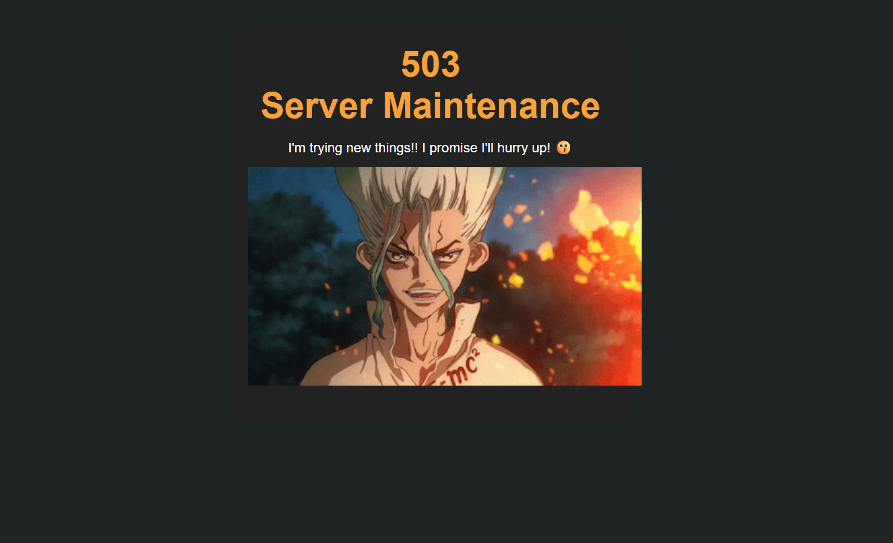
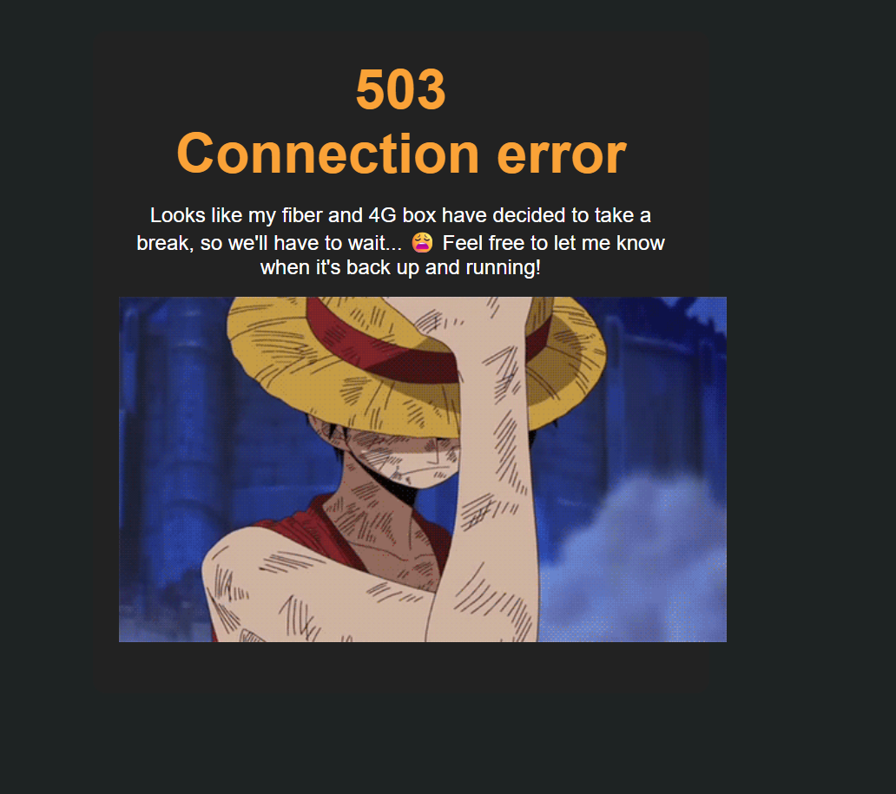
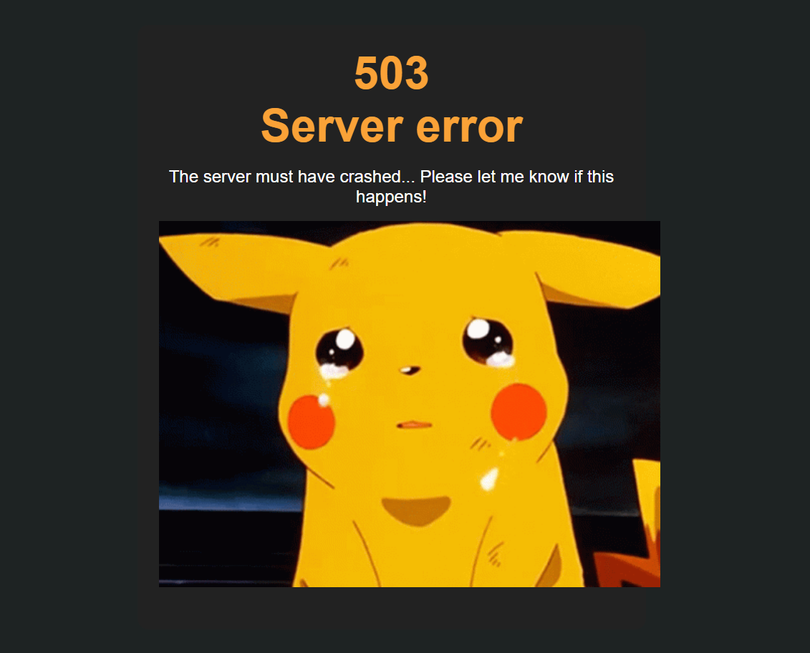
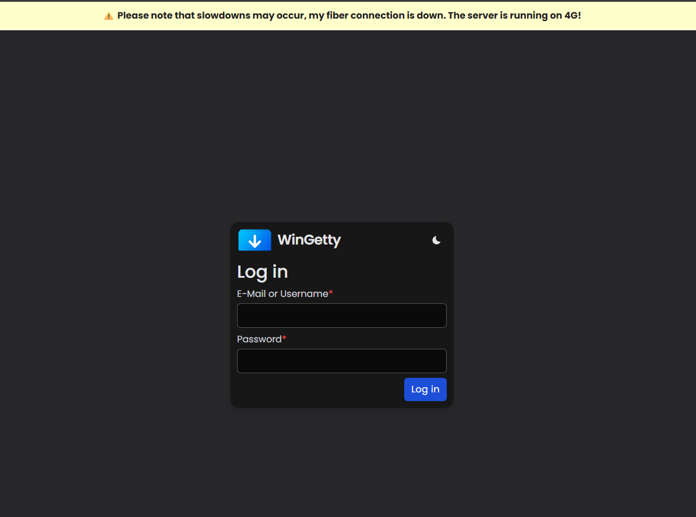
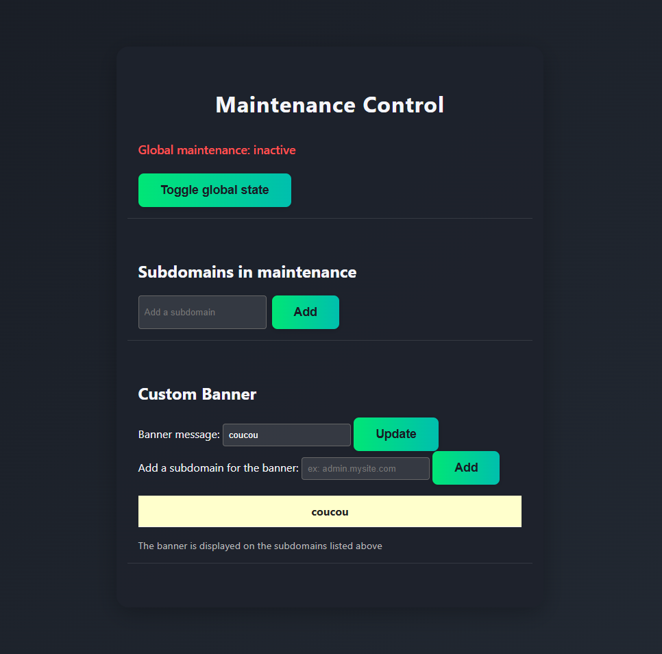

## Installation Steps

### 1. Fork this repository

### 2. Edit variable in wrangler.toml

- Set your language (FR or EN)
- Change the text message for the various error

### 3. Create a KV namespace

- In Cloudflare, go to **Workers > KV**.
- Create a namespace named: ``` cloudflare-worker-error-page ```
- Copy the namespace ID and add it to the `id` field in the `kv_namespaces` section of the `wrangler.toml` file.


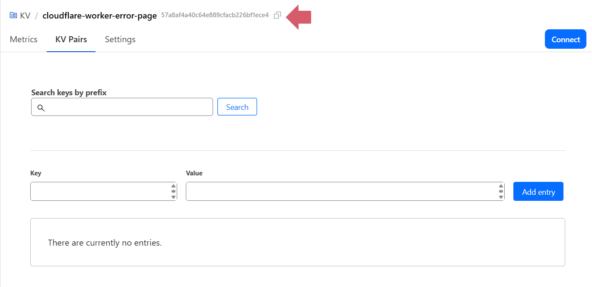

### 4. Config sub domain

- create a subdomain ``` maintenance.domain.fr ``` and redirect it to your reverse proxy
- create an other subdomain for check if the worker can acces to your reverse proxy for check error ``` test.domain.fr ```
- open a port on your server which will be used by the worker to determine whether your server is down or your connection is down you can use whichever port you want.
- For safety you can limite the IP who can acces to the cloudflare Ip accesible [here](https://www.cloudflare.com/fr-fr/ips/)

#### Exemple for limite acces to cloudflare ip on Unifi
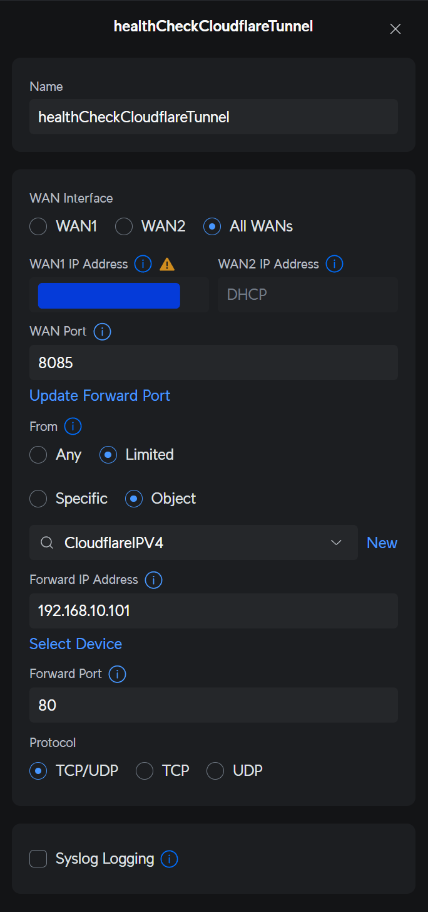
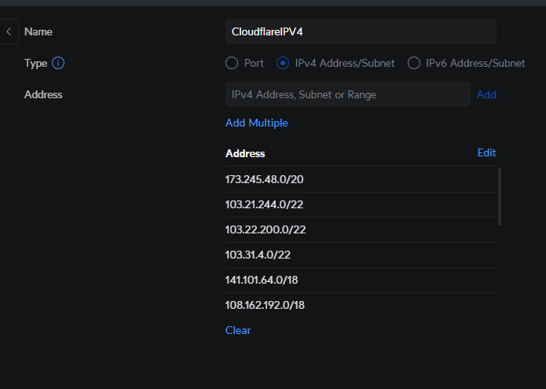

### 5. Create a Worker on Cloudflare

- Log in to your Cloudflare dashboard.
- Go to the **Workers Routes** section.
- Got to Manage Workers.
- Go to Create
- Select import a repository
- Link your Github account to Cloudflare and select the repository forked
- Add the project name : ``` cloudflare-worker-error-page ```
- Add the build command : ``` npx wrangler deploy --assets=./ ```
- Go to Create and deploy
- Wait for the build to finish and click on continue to project
- Go to Settings -> Domains & Routes -> Add
- Click on Route and selecto your domaine in Zone
- Add this on Route : ``` *domain.fr/* ``` Don't put the . after the first * otherwise it's going to work only for subdomain. And you can add multiple Route with multiple domain
- Add the secret MAINTENANCE_DOMAIN with the domain create earlier
- Add the secret NPM_HEALTH_URL with the test domain create earlier
- Add the secret ORIGIN_PING_URL with your server ip and the port open earlier


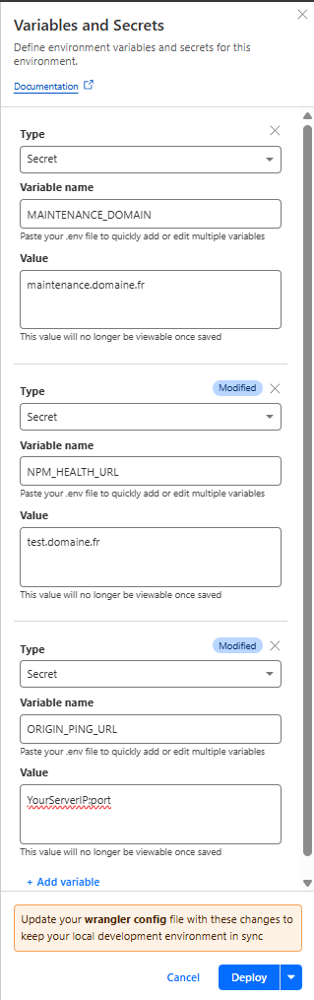

### 6. OPTIONAL Add a docker container on your server for send the info to Cloudflare when your 4G/5G backup is active

- On wrangler.toml set ``` ENABLE_4G_BANNER = true ```

#### Option 1: Use the pre-built Docker image (Recommended)

⚠️ If you have fork my repository you can edit the ``` ghcr.io/jamesdadams/cloudflare-worker-error-page:latest ```
with your github name -> ``` ghcr.io/YourGithubName/cloudflare-worker-error-page:latest ```

- Use the pre-built image from GitHub Container Registry:
```bash
docker run -e CF_ACCOUNT_ID=Your_cloudflare_account_id \
           -e CF_NAMESPACE_ID=Your_cloudflare_namespace_id \
           -e CF_API_TOKEN=Your_cloudflare_api_token \
           -e KV_IP_KEY=wan-ip \
           -e KV_4G_KEY=wan-is-4g \
           -e SLEEP_SECONDS=60 \
           ghcr.io/jamesdadams/cloudflare-worker-error-page:latest
```

#### Option 2: Build the image yourself

- Clone this repo on your server
- Execute ``` docker build -t wan-ip-checker ./docker ``` to build the docker image
- Launch the docker container with this command:
```bash
docker run -e CF_ACCOUNT_ID=Your_cloudflare_account_id \
           -e CF_NAMESPACE_ID=Your_cloudflare_namespace_id \
           -e CF_API_TOKEN=Your_cloudflare_api_token \
           -e KV_IP_KEY=wan-ip \
           -e KV_4G_KEY=wan-is-4g \
           wan-ip-checker
```

- You can get your account id on the [dashboard](https://dash.cloudflare.com/login), click on the 3 dot right to your mail
- You can get your namespace id in your wrangler.toml
- For generate a new api token go to your profile -> API Tokens -> Create Token -> click on Use template for Edit Cloudflare Workers
- remove every permissions except **Workers KV Storage** and set it to Edit
- On Account Resources select your cloudflare account
- On Zone Resources select Include and All zones
- Click on **Continue to summary** and **Create token**
- SLEEP_SECONDS is how often the container will check the server's IP address.

### 7. Add Auth on your maintenance page

TO DO 

---


## <a name="français"></a>🇫🇷 Français

# Page d'erreur Cloudflare Worker

Ce projet vous permet de déployer des pages d'erreur personnalisée à l'aide d'un Cloudflare Worker

- Un mode maintenance, 
- Ajouter une bannière à un ou plusieurs domaines spécifiques
- Afficher une bannière lorsque votre backup LTE est actif.
- Un bouton pour vous signaler une erreur qui envoie une notification sur Discord


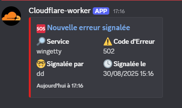

## Étapes d'installation

### 1. Forkez ce dépôt

### 2. Modifiez les variables dans wrangler.toml

- Définissez votre langue (FR ou EN)
- Si vous ne voulez pas avoir la fonctionnalité pour signaler une erreur qui permet d'envoyer un message Discord faite ceci : ```ENABLE_REPORT_ERROR = false```
- Si vous n'avez pas de backup 4g sur votre serveur, faite ceci : ```ENABLE_4G_BANNER = false ```
- Normalement, ce n'est pas nécessaire de modifier, mais vous pouvez pour chaque message d'erreur ajouter son code d'erreur pour `TEXT_BOX_ERROR_CODE`, `TEXT_TUNNEL_ERROR_CODE` et `TEXT_CONTAINER_ERROR_CODE`
- Modifiez le texte des différents messages d'erreur si vous le voulez
### 3. Créez un namespace KV

- Sur Cloudflare, allez dans **Storage & Databases > KV**.

- Créez un namespace nommé : ``` cloudflare-worker-error-page ```

- Copiez l'ID du KV et ajoutez-le au champ `id` dans la section `kv_namespaces` du fichier `wrangler.toml`.


### 4. Configurez le sous-domaine

- Créez un sous-domaine ``` maintenance.domain.fr ``` et redirigez-le vers votre reverse proxy
- Ouvrez un port sur votre serveur qui sera utilisé par le worker pour déterminer si votre serveur est hors ligne ou si votre connexion est coupée. Vous pouvez utiliser n'importe quel port.
- Pour la sécurité, vous pouvez limiter les IP qui peuvent accéder aux IP Cloudflare accessibles [ici](https://www.cloudflare.com/fr-fr/ips/)

#### Exemple pour limiter l'accès aux IP Cloudflare sur Unifi


### 5. Créez un Worker sur Cloudflare

- Connectez-vous à votre tableau de bord Cloudflare.
- Allez dans la section **Workers Routes**.
- Allez dans Gérer les Workers.

- Cliquez sur Créer

- Sélectionnez importer un dépôt

- Liez votre compte Github à Cloudflare et sélectionnez le dépôt forké

- Ajoutez le nom du projet : ``` cloudflare-worker-error-page ```
- Ajoutez la commande de build : ``` npx wrangler deploy --assets=./ ```
- Cliquez sur Créer et déployer
- 
- Attendez la fin du build et cliquez sur continuer vers le projet

- Allez dans Paramètres -> Domaines & Routes -> Ajouter

- Cliquez sur Route et sélectionnez votre domaine dans Zone

- Ajoutez ceci dans Route : ``` *domain.fr/* ``` Ne mettez pas le . après le premier * sinon cela ne fonctionnera que pour le sous-domaine. Vous pouvez ajouter plusieurs routes avec plusieurs domaines.
- Selectionner Fail open (Cela permet de quand même accéder au site si le Worker ne fonctionne plus à cause d'un bug ou du quota qui est atteint)

- Dans Variables and Secrets ajoutez MAINTENANCE_DOMAIN avec le domaine créé précédemment (Ex: maintenance.domain.fr)
- Dans Variables and Secrets ajoutez ORIGIN_PING_URL avec l'IP de votre serveur et le port ouvert précédemment (Ex: 172.18.95.145:5055)
- Dans Variables and Secrets si vous avez activez l'envoie de notif discord ajouter votre webhook discord `REPORT_ERROR_DISCORD_WEBHOOK_URL`
- Cliquer sur Deploy
- 


### 6. OPTIONNEL : Ajoutez un conteneur Docker sur votre serveur pour envoyer l'info à Cloudflare lorsque votre backup 4G/5G est actif

- Dans wrangler.toml, mettez ``` ENABLE_4G_BANNER = true ```

- Utilisez l'image pré-construite depuis GitHub Container Registry :

```bash
docker run -e CF_ACCOUNT_ID=Votre_id_compte_cloudflare \
           -e CF_NAMESPACE_ID=Votre_id_namespace_cloudflare \
           -e CF_API_TOKEN=Votre_token_api_cloudflare \
           -e KV_IP_KEY=wan-ip \
           -e KV_4G_KEY=wan-is-4g \
           -e SLEEP_SECONDS=60 \
           ghcr.io/jamesdadams/cloudflare-worker-error-page:latest
```

- Vous pouvez obtenir votre id de compte sur le [dashboard](https://dash.cloudflare.com/login), cliquez sur les 3 points à droite de votre mail
- 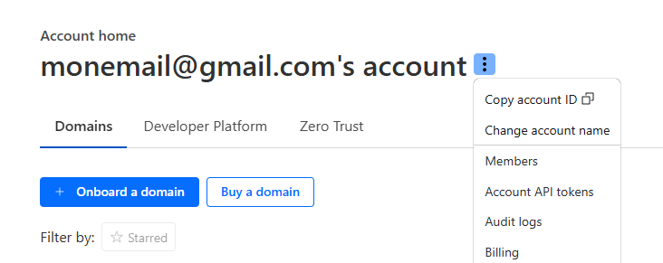
- Vous pouvez obtenir votre id de namespace dans votre wrangler.toml `{ binding = "MAINTENANCE_KV", id = "VOTREID" }`
- Pour générer un nouveau token API, allez dans votre profil -> API Tokens -> Créer un token -> cliquez sur Utiliser le template pour Edit Cloudflare Workers
- 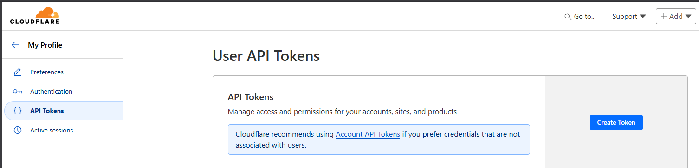
- Retirez toutes les permissions sauf **Workers KV Storage** et mettez-la sur Edit
- Dans Account Resources, sélectionnez votre compte Cloudflare
- Cliquez sur **Continuer vers le résumé** et **Créer le token**
- 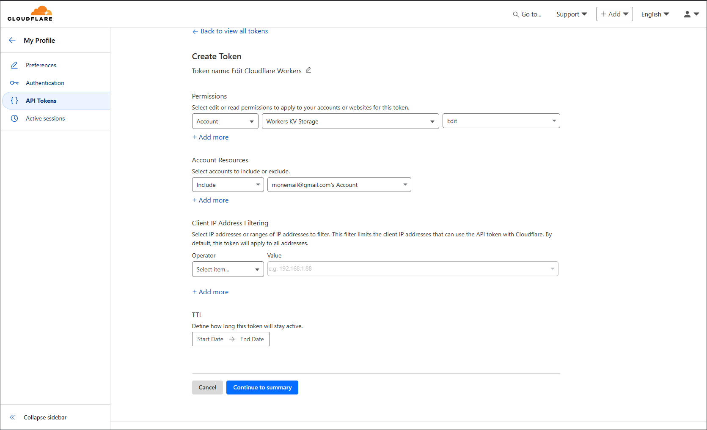
- SLEEP_SECONDS définit la fréquence à laquelle le conteneur vérifiera l'adresse IP du serveur.

### 7. Ajoutez une authentification sur votre page de maintenance

À FAIRE

