<!-- Choisissez votre langue / Choose votre language: -->
[en English](#english) | [🇫🇷 Français](#français)

---

## <a name="english"></a>en English

# Cloudflare Worker Error Page

This project allows you to deploy a custom error page using a Cloudflare Worker.

## Installation Steps

### 1. Fork this repository

### 2. Create a Worker on Cloudflare

- Log in to your Cloudflare dashboard.
- Go to the **Workers Routes** section.
- Got to Manage Workers.
- Go to Create
- Select import a repository
- Link your Github account to Cloudflare and select the repository forked
- Add the project name : ``` cloudflare-worker-error-page ```
- Add the build command : ``` npx wrangler deploy --assets=./ ```
- Go to Create and deploy
- Wait for the build to finish and click on continue to project
- Go to Settings -> Domains & Routes -> Add
- Click on Route and selecto your domaine in Zone
- Add this on Route : ``` *domain.fr/* ``` Don't put the . after the first * otherwise it's going to work only for subdomain. And you can add multiple Route with multiple domain

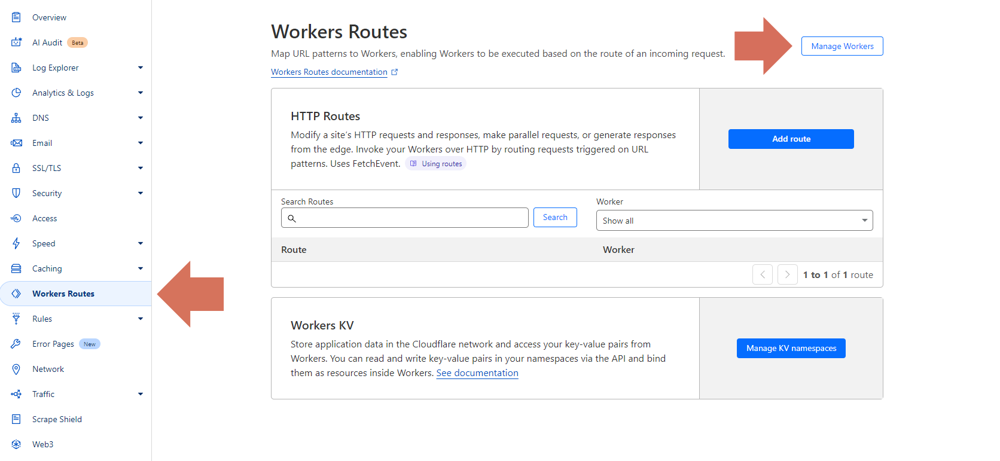
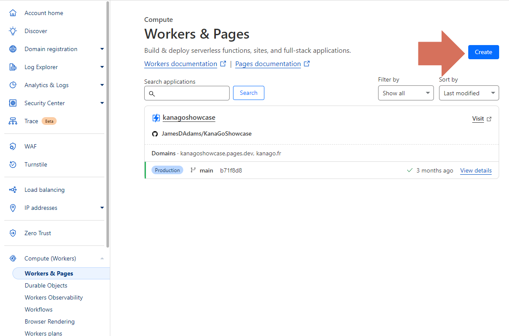
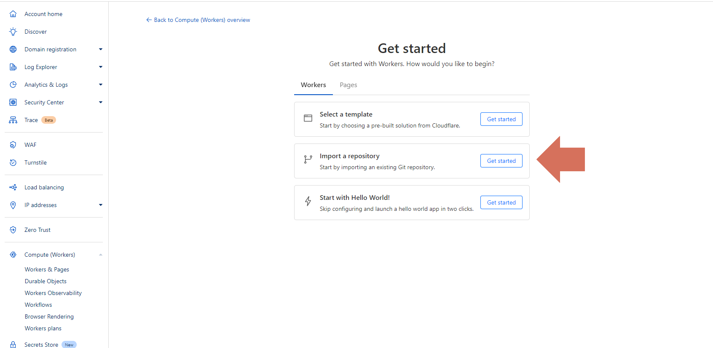
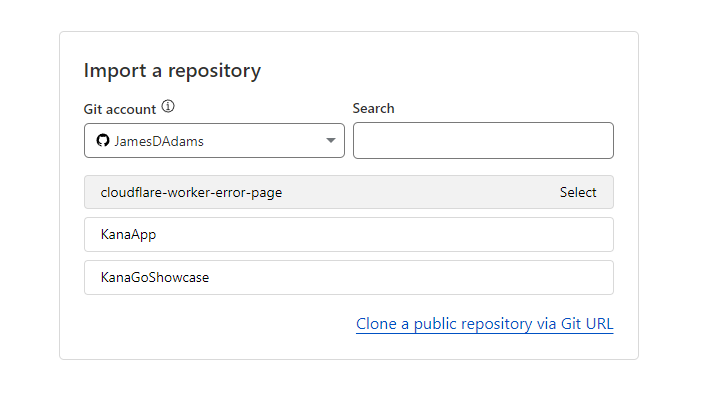
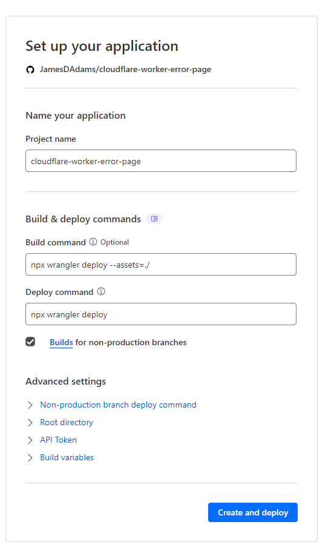
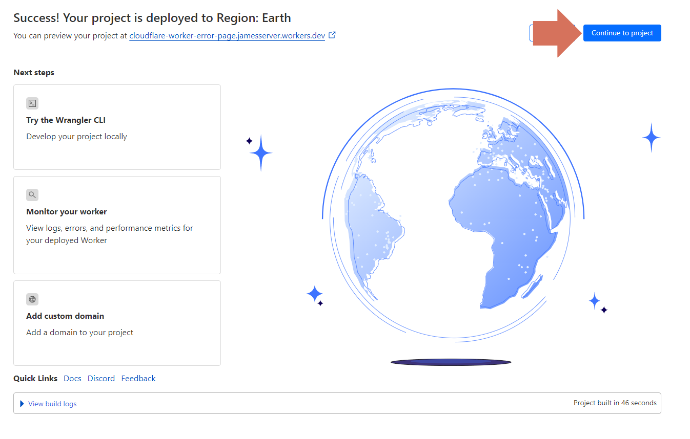
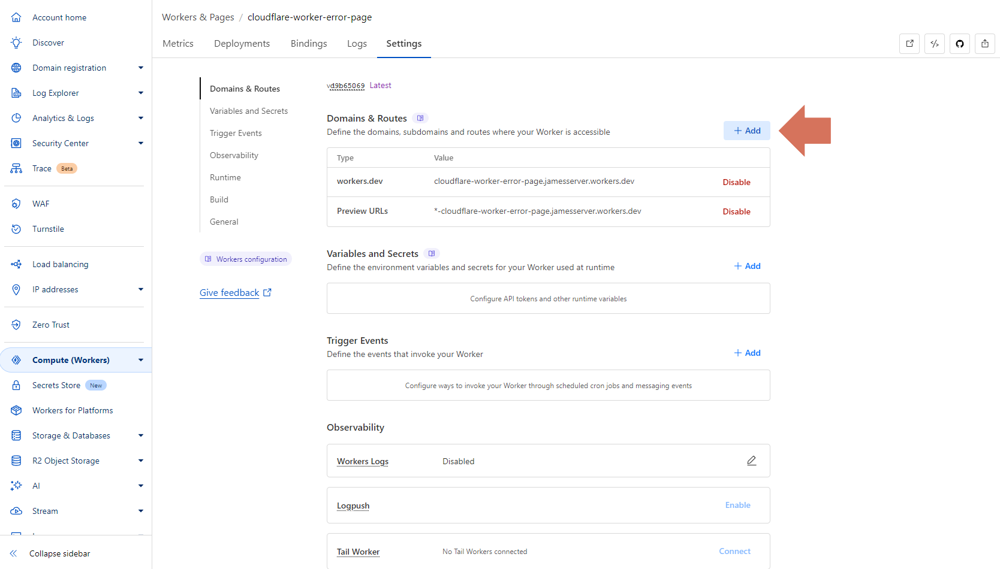
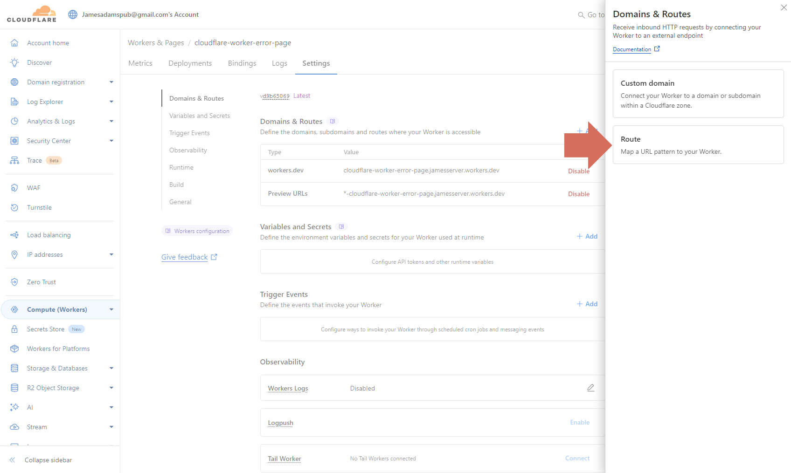
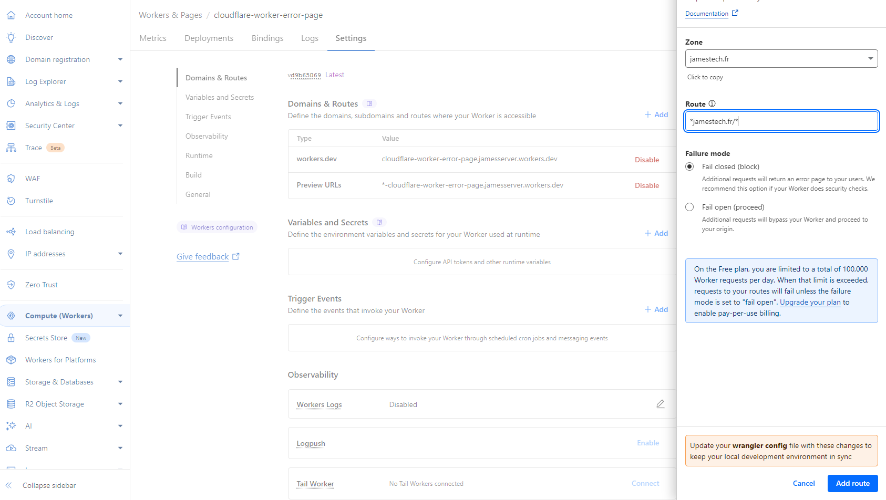

### 3. Create a KV namespace

- In Cloudflare, go to **Workers > KV**.
- Create a namespace named: ``` cloudflare-worker-error-page ```
- Copy the namespace ID and add it to the `id` field in the `kv_namespaces` section of the `wrangler.toml` file.
- Because you link the github repo with Cloudflare the projet the worker will be automatically updated.

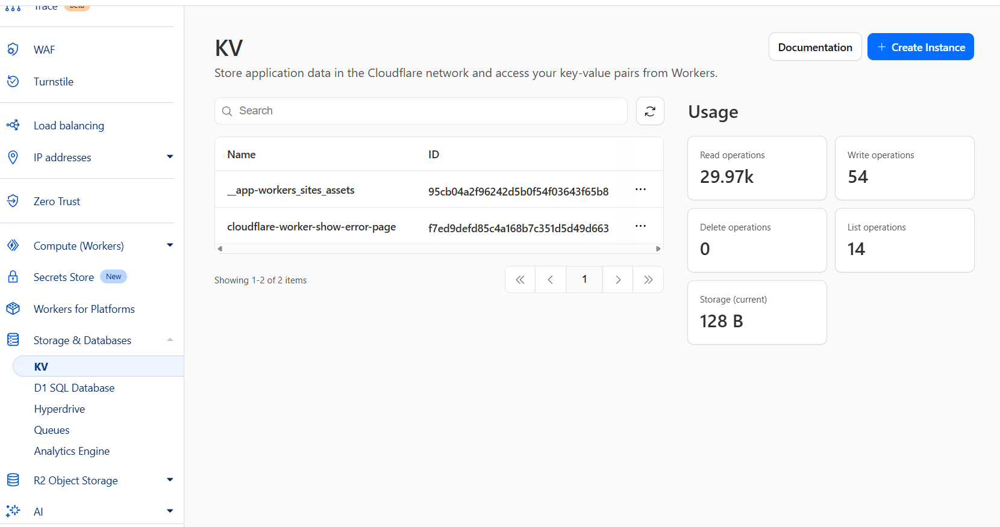
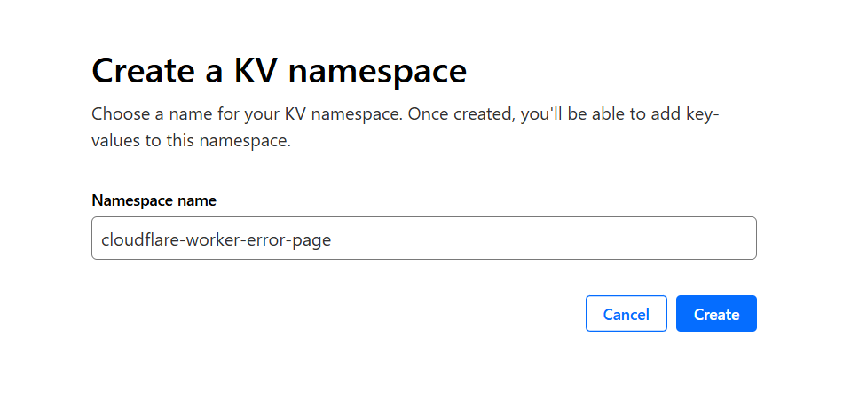


### 4. Enable environment variables

- Open the `wrangler.toml` file.
- Remove the `#` in front of the variables you want to enable, or add them as **secrets** in Cloudflare (Worker Variables/Secrets section).
- Alternatively, you can leave the `#` and add the variables as secrets in the Worker.

## Notes

- Canva URLs for error pages are configurable in `wrangler.toml`.

---


## <a name="français"></a>🇫🇷 Français

# Cloudflare Worker Error Page

Ce projet permet de déployer une page d'erreur personnalisée via un Worker Cloudflare.

## Étapes d'installation

### 1. Créer un Worker sur Cloudflare

- Connectez-vous à votre dashboard Cloudflare.
- Allez dans la section **Workers**.
- Créez un nouveau Worker.
- Configurez la route sur votre domaine principal comme ceci : *kanago.fr/*

### 2. Forker ce dépôt


### 3. Lier le Worker à ce dépôt

- Dans le dashboard Cloudflare, liez le Worker créé à votre repo forker

### 4. Activer les variables d'environnement

- Ouvrez le fichier `wrangler.toml`.
- Retirez les `#` devant les variables à activer, ou ajoutez-les en tant que **secrets** dans Cloudflare (section Variables/Secrets du Worker).
- A la place vous pouvez aussi laissez les `#` mais ajouter les variables en tant que secrets dans le Worker

### 5. Créer un namespace KV

- Dans Cloudflare, allez dans **Workers > KV**.
- Créez un namespace nommé :  
  ```
  cloudflare-worker-error-page
  ```
- Copiez l'ID du namespace et ajoutez-le dans le champ `id` de la section `kv_namespaces` du fichier `wrangler.toml`.


### 6. Déployer le Worker

Si vous avez bien lier votre repo forker a votre Worker cloudflare il ve se deployer automatiquement a chaque modification

## Notes

- Les URLs Canva pour les pages d'erreur sont configurables dans `wrangler.toml`.
